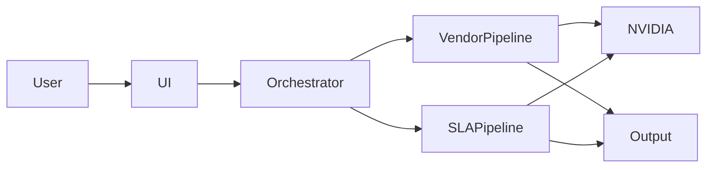
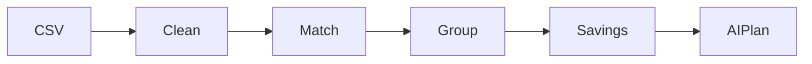
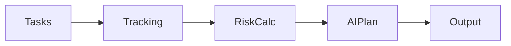

# 🛡️ ArthaRakshak — Enterprise Cost Intelligence System

> **"Artha"** = Wealth · **"Rakshak"** = Protector  
> *AI-powered guardian for enterprise financial health*

---

<div align="center">


**ET AI Hackathon 2026 · Enterprise Cost Optimization**

</div>

---

# 📌 Overview

**ArthaRakshak** is a **multi-agent AI system** designed to eliminate financial inefficiencies in enterprises.

It solves two major problems:

| Module | Purpose |
|------|--------|
| 🔍 Vendor Deduplication | Detects duplicate vendors & saves cost |
| ⏰ SLA Risk Monitor | Predicts SLA breaches & penalty risks |

---

# 🚀 Key Features

- 🧠 AI-generated action plans (NVIDIA LLaMA)
- 💰 Realistic savings estimation (70% recovery)
- 🔍 Smart vendor matching (noise-word removal)
- ⏰ SLA breach prediction before deadline
- 📊 Dashboard with audit logs
- 🔌 Modular agent-based architecture

---

# 🏗️ System Architecture



---

# 🔄 Full System Flow

```mermaid
flowchart TD
    A[User Upload CSV] --> B[Streamlit UI]
    B --> C[Orchestrator]
    C --> D[Vendor Pipeline]
    C --> E[SLA Pipeline]
    D --> F[Scanner]
    F --> G[Finance]
    G --> H[Advisor (LLM)]
    E --> I[Tracker]
    I --> J[Risk]
    J --> K[Recovery (LLM)]
    H --> L[Results]
    K --> L
    L --> M[Dashboard]
```

---

# 🔍 Module 1 — Vendor Deduplication

## 📌 Problem
Duplicate vendors → hidden financial loss

## ⚙️ Flow



## 💰 Savings Formula

```
Savings = (Total Spend - Max Spend) × 0.70
```

---

# ⏰ Module 2 — SLA Risk Monitor

## 📌 Problem
SLA breaches detected too late → penalties

## ⚙️ Flow



## 📊 Risk Formula

```
days_needed = tasks_remaining / current_rate
miss_days = max(0, days_needed - days_remaining)
risk = miss_days × penalty_per_day
```

---

# 🤖 Agents Overview

| Agent | Role | AI Used |
|------|------|--------|
| Orchestrator | Controls flow & logging | ❌ |
| Scanner | Detect duplicates | ❌ |
| Finance | Calculate savings | ❌ |
| Advisor | Generate strategy | ✅ |
| Tracker | Monitor progress | ❌ |
| Risk | Calculate SLA risk | ❌ |
| Recovery | Plan + email | ✅ |

---

# 🛠️ Tech Stack

| Layer | Tech |
|------|------|
| UI | Streamlit |
| Backend | Python |
| Data | Pandas |
| AI | NVIDIA LLaMA |
| Matching | RapidFuzz |
| Charts | Plotly |

---

# 📁 Project Structure

```
ArthaRakshak/
├── app.py
├── .env
├── requirements.txt
├── agents/
└── data/
```

---

# ⚙️ Setup

```bash
git clone <repo>
cd artharakshak

python -m venv venv
source venv/bin/activate

pip install -r requirements.txt
```

### Run App

```bash
streamlit run app.py
```

---

# 📄 License

MIT License

---

<div align="center">

**ArthaRakshak — Every Rupee Matters**

</div>
